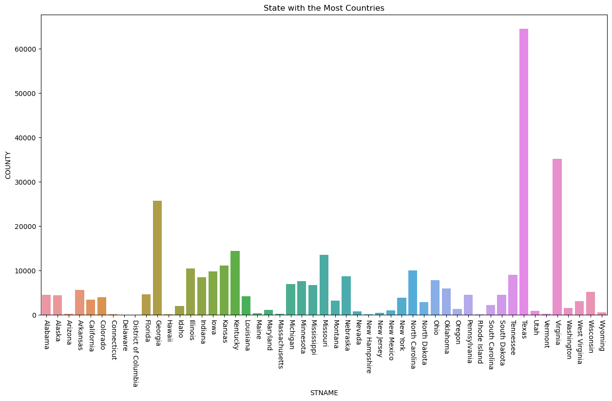

# -project
Internship Project @ quantum Analytics
# [Project : PYTHON PROJECT ON USA CENSUS

# Python Project using dataset provided by Quantum Analytics.

* The analysis was done using python to fillter and clean up data.
* The chart below reviews the state with the most county.
* From the dataset it was deduced that Texa has the most county.
* Virginia was the second in line followed by Georgia, Kentuchy, Missouri and other states as shown in the chart
* ## Overview of Dashboard Summary  

# State With The Most Populous State
* The analysis was done using python to fillter and clean up data.
* The Dashboard reviews insights on Global Hospital Ranking by Country counts, Top hospital by size, Rich Files, Rank and Scholarrship score.
* From the dataset it was deduced from the top hospital counts that United states  had the highest hospital count and turkey had the lowest.
* It was also seen going by top hospital size that the New york Presbtyterian/lower manhanttan Hospital had the higest hospital size while the cleverland Cliniic had the lest.
* On reviewing the top perfornmance of hospital by Rich files it was seen that the University of Maryland Medical Centerr had the most Rich File while Cleverland Clinic had the lest
* On Ranking the of hospital the New york Presbtyterian/lower manhanttan Hospital has the higest rank among the top hospital by performance 
* Finally on reviewing the top hospital performance by scholarship the New york Presbtyterian/lower manhanttan Hospital also reviews to have the higest scholarship score while Cleverland Clinic was see to have the lowest.
## Overview of Dashboard Summary  

