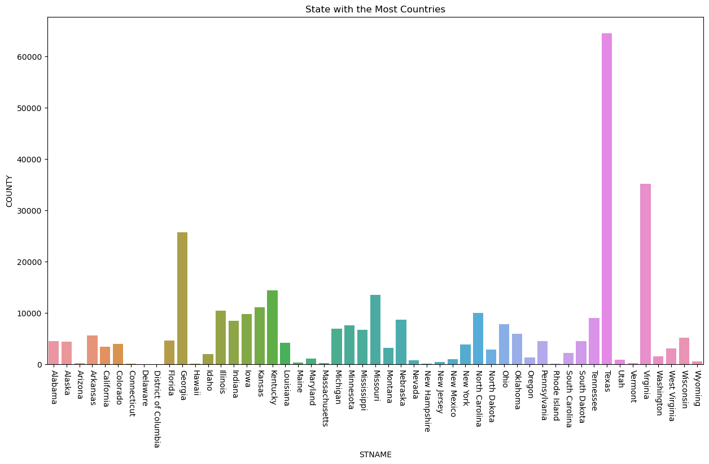
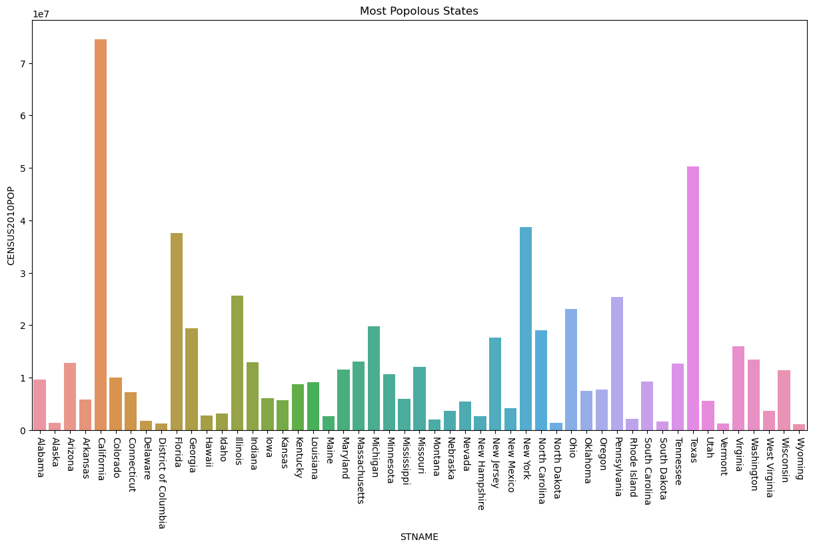

# -project
Internship Project @ quantum Analytics
# [Project : PYTHON PROJECT ON USA CENSUS

# Python Project using dataset provided by Quantum Analytics.

* The analysis was done using python to fillter and clean up data.
* The chart below reviews the state with the most county.
* From the dataset it was deduced that Texa has the most county.
* Virginia was the second in line followed by Georgia, Kentuchy, Missouri and other states as shown in the chart
* ## Overview of Chart Summary 

# State With The Most Populous State
* The chart below reviews the most populous state. 
* from the dataset the most populous state is California.
* Second in line was texas, followed by Newyork, florida and other state has show below in the chart
* The chart equally indicates the lowest ranking states 
## Overview of Dashboard Summary  

